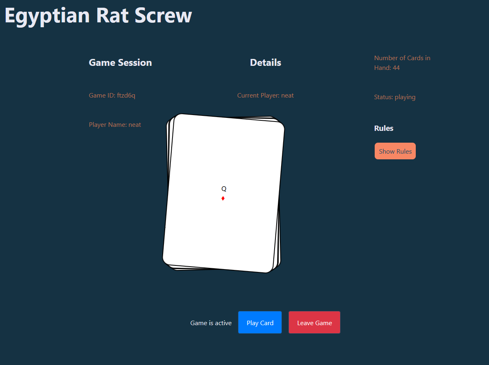

# Online Egyptian Rat Screw

## Project Structure

### Overview

The project is divided into two main parts: server and client.

### Server

The server-side code is located in the `server` directory and consists of the following key files:

- `socketEvents.ts`: Defines the socket event types used for communication between the server and clients.

- `GameManager.ts`: Manages the creation and tracking of game instances.

- `socketHandlers.ts`: Contains the handlers for various socket events, processing client requests and updating game state.

- `index.ts`: The main entry point for the server, setting up the Express app and Socket.IO server.

- `config.ts`: Contains server configuration settings, such as the port number.

- `types.ts`: Defines TypeScript interfaces and types used throughout the server-side code.

- `game/Game.ts`: Implements the core game logic and state management for individual game instances.

- `game/CardUtils.ts`: Provides utility functions for card-related operations.

- `game/Deck.ts`: Implements the deck creation and card dealing functionality.

- `game/Player.ts`: Represents a player in the game, managing their hand and actions.

- `game/rules/RuleEngine.ts`: Handles the game rules and validates player actions.

- `game/rules/Condition.ts`: Implements the condition checking logic for slap rules.

### Key Components

1. **Socket Event Handling**
   The `socketHandlers.ts` file sets up the main Socket.IO event listeners, delegating most of the game logic to the `GameManager` class. It handles events such as player connections, game joins, and player actions.

2. **Game Management**
   The `GameManager` class in `GameManager.ts` is responsible for creating, tracking, and managing game instances. It handles player joins, leaves, and coordinates game actions. It also manages the lobby state and player information.

3. **Game Logic**
   The `Game` class in `game/Game.ts` implements the core game logic, including:

   - Turn management
   - Card playing
   - Slap handling
   - Face card challenges
   - Vote system for game actions

4. **Rule Engine**
   The `RuleEngine` class in `game/rules/RuleEngine.ts` manages the game rules, including:

   - Slap validation
   - Face card challenges
   - Custom rule conditions

5. **Player Management**
   The `Player` class in `game/Player.ts` represents individual players, managing their hands and actions within the game.

6. **Type Definitions**
   The `types.ts` file contains crucial TypeScript interfaces and types used throughout the server-side code, ensuring type safety and consistency across the application.

7. **Card and Deck Management**
   The `CardUtils.ts` and `Deck.ts` files handle card-related operations, including deck creation, shuffling, and dealing.

8. **Configuration**
   The `config.ts` file contains server configuration settings, allowing for easy adjustment of server parameters like the port number.

### Key Features

1. **Real-time Multiplayer**
   The game uses Socket.IO for real-time communication between the server and clients, enabling instant updates and responsive gameplay.

2. **Flexible Rule System**
   The `RuleEngine` allows for easy addition and modification of game rules, including custom slap conditions.

3. **Lobby System**
   Players can join a lobby before entering a game, allowing for game setup and player management.

4. **Voting Mechanism**
   The game includes a voting system for certain game actions, adding an element of group decision-making to the gameplay.

5. **Scalable Architecture**
   The server architecture is designed to handle multiple concurrent games and players efficiently.
